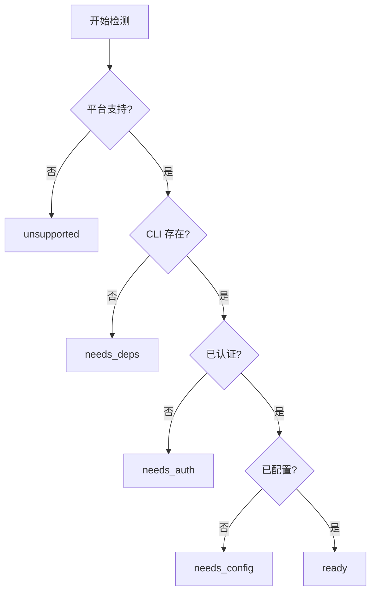

# 技能市场产品设计文档

> OpenClaw CN 技能市场 - 让 AI 助手能力可扩展

## 一、产品概述

### 1.1 产品定位
技能市场是 OpenClaw CN 的核心功能模块，允许用户通过安装"技能"来扩展 AI 助手的能力。每个技能封装了特定的工具、API 或服务集成，用户无需编程即可让 AI 助手获得新能力。

### 1.2 核心价值
- **即插即用**: 一键安装，自动配置
- **能力扩展**: 从搜索、笔记到代码管理，覆盖各类场景
- **配置驱动**: 所有配置集中管理，支持多平台

### 1.3 目标用户
- 企业用户：通过企业微信/钉钉/飞书使用 AI 助手
- 开发者：希望快速集成各类工具和服务
- 个人用户：希望 AI 助手能帮助完成更多任务

---

## 二、技能生命周期

### 2.1 状态流转图

```
                                    ┌─────────────┐
                                    │ not_installed│
                                    └──────┬──────┘
                                           │ install
                                           ▼
                                    ┌─────────────┐
                                    │  installing  │
                                    └──────┬──────┘
                                           │
                        ┌──────────────────┼──────────────────┐
                        ▼                  ▼                  ▼
                 ┌─────────────┐    ┌─────────────┐    ┌─────────────┐
                 │  needs_deps │    │  needs_auth │    │ needs_config│
                 │  缺少 CLI   │    │  需要登录   │    │  需要配置   │
                 └──────┬──────┘    └──────┬──────┘    └──────┬──────┘
                        │                  │                  │
                        │ install_deps     │ auth             │ configure
                        ▼                  ▼                  ▼
                 ┌─────────────┐    ┌─────────────┐    ┌─────────────┐
                 │installing_deps│  │   ready     │◄───│  configuring │
                 └──────┬──────┘    └──────┬──────┘    └─────────────┘
                        │                  │
                        └──────────────────┤
                                           │ enable
                                           ▼
                                    ┌─────────────┐
                                    │    active   │ ◄──► disabled
                                    │   运行中    │
                                    └─────────────┘
```

### 2.2 状态说明

| 状态 | 图标 | 说明 | 用户操作 |
|------|------|------|----------|
| `not_installed` | ➕ | 未安装，在市场中可见 | 点击安装 |
| `installing` | ⏳ | 正在复制技能文件 | 等待 |
| `needs_deps` | 📦 | 缺少 CLI 工具 | 安装依赖 |
| `installing_deps` | ⏳ | 正在安装依赖 | 等待 |
| `needs_auth` | 🔑 | 需要登录认证 | 执行认证命令 |
| `needs_config` | ⚙️ | 需要配置 API Key | 填写配置 |
| `configuring` | ⏳ | 正在保存配置 | 等待 |
| `ready` | ✅ | 已就绪，可启用 | 启用 |
| `active` | 🟢 | 运行中，Agent 可调用 | 禁用/配置 |
| `disabled` | ⏸️ | 已禁用 | 启用 |
| `unsupported` | 🚫 | 当前平台不支持 | 无 |
| `error` | ❌ | 出现错误 | 重试 |

### 2.3 检测顺序（依赖清单驱动）

```
1. 平台检测   → 不支持当前 OS    → unsupported
2. 安装检测   → 未安装          → not_installed
3. 依赖检测   → 缺少 CLI 工具    → needs_deps
4. 认证检测   → 未登录          → needs_auth
5. 配置检测   → 缺少 API Key    → needs_config
6. 全部通过   →                 → ready
```

**核心原则：**
- **依赖清单是真理来源** - 所有检测基于 `metadata.openclaw.requires`
- **安装指导清晰** - `install[]` 描述所有平台的安装方式
- **用户可见的提示** - 缺失什么、如何解决，都来自配置

---

## 三、技能模块化设计（核心）

### 3.0 模块化架构

每个技能是一个独立模块，包含两个文件：

```
skills-registry/
├── github/
│   ├── skill.json     # 技能元数据 (类似 package.json)
│   ├── SKILL.md       # 纯 Markdown 指令 (给 LLM)
│   └── scripts/       # 可选: 自定义检测脚本
│       └── check-auth.js
├── notion/
│   ├── skill.json
│   └── SKILL.md
└── ...
```

**分工：**
- **skill.json** → 给程序/UI 读取，包含依赖、安装方式、认证等
- **SKILL.md** → 给大模型读取，包含使用指令和示例

### 3.1 依赖清单驱动哲学

**设计原则：**

1. **单一真理来源** - `skill.json` 中的 `requires` 是唯一依赖清单
2. **完整性检查** - 安装时和运行时都基于清单检查
3. **可操作性** - 每个缺失项都有明确的解决方案
4. **跨平台适配** - 安装方法自动选择当前平台可用的

**依赖清单结构（对象数组）：**

`requires` 是一个**对象数组**，每个对象代表一个检测项，包含检测方法和解决方案：

```typescript
type RequirementItem = 
  | PlatformRequirement    // 平台检测
  | BinRequirement         // CLI 工具检测
  | AnyBinRequirement      // 任一 CLI 检测
  | VersionRequirement     // CLI 版本检测
  | ServiceRequirement     // 服务运行检测
  | FileRequirement        // 文件/目录检测
  | AuthRequirement        // 认证检测
  | EnvRequirement         // 环境变量检测
  | SkillRequirement;      // 技能依赖检测

// 平台检测
interface PlatformRequirement {
  type: "platform";
  os: Platform[];          // ["darwin", "linux", "win32"]
  message: string;         // "此技能仅支持 macOS 和 Linux"
}

// CLI 工具检测
interface BinRequirement {
  type: "bin";
  name: string;            // "gh"
  message: string;         // "需要安装 GitHub CLI"
  install: InstallMethod[];  // 安装方法直接关联
}

// 任一 CLI 检测
interface AnyBinRequirement {
  type: "anyBin";
  names: string[];         // ["nano-pdf", "pdf-cli"]
  message: string;
  install: InstallMethod[];
}

// 认证检测
interface AuthRequirement {
  type: "auth";
  command: string;         // "gh auth status"
  expect: string;          // "Logged in" (正则匹配)
  message: string;         // "需要登录 GitHub"
  action: string;          // "gh auth login" (显示给用户)
  helpUrl?: string;        // 帮助链接
}

// 环境变量检测
interface EnvRequirement {
  type: "env";
  name: string;            // "GITHUB_TOKEN"
  message: string;         // "需要配置 GitHub Token"
  description?: string;    // "Personal Access Token"
  helpUrl?: string;        // 获取教程链接
  placeholder?: string;    // "ghp_xxxxxxxxxxxx"
}

// 版本检测（检测 CLI 工具版本）
interface VersionRequirement {
  type: "version";
  bin: string;             // "node"
  command?: string;        // "node --version" (默认: bin --version)
  minVersion: string;      // "18.0.0"
  message: string;         // "需要 Node.js 18+"
  install?: InstallMethod[];
}

// 服务检测（检测服务是否运行）
interface ServiceRequirement {
  type: "service";
  command: string;         // "docker info"
  expect?: string;         // 成功时输出匹配
  message: string;         // "需要启动 Docker Desktop"
  action?: string;         // 启动命令/提示
  helpUrl?: string;
}

// 文件/目录检测
interface FileRequirement {
  type: "file";
  path: string;            // "~/.kube/config" 或相对路径
  message: string;         // "需要配置 Kubernetes"
  helpUrl?: string;
}

// 技能依赖（依赖其他技能）
interface SkillRequirement {
  type: "skill";
  skillId: string;         // "web-search"
  message: string;         // "需要安装网络搜索技能"
}

// 自定义脚本检测 (新增)
interface ScriptRequirement {
  type: "script";
  path: string;            // "scripts/check-auth.js" (相对于技能目录)
  message: string;         // "需要登录"
  action?: string;         // 失败时显示的操作提示
  helpUrl?: string;        // 帮助链接
  timeout?: number;        // 超时时间 (ms), 默认 5000
}
```

**检测类型与状态映射：**

| type | 说明 | 失败状态 | 解决方案 |
|------|------|---------|----------|
| `platform` | 平台检测 | `unsupported` | 显示 message |
| `bin` | CLI 工具存在 | `needs_deps` | 显示 install[] |
| `anyBin` | 任一 CLI 存在 | `needs_deps` | 显示 install[] |
| `version` | CLI 版本要求 | `needs_deps` | 显示 install[] |
| `service` | 服务运行状态 | `needs_deps` | 显示 action |
| `file` | 文件/目录存在 | `needs_config` | 显示 helpUrl |
| `auth` | CLI 认证状态 | `needs_auth` | 显示 action + helpUrl |
| `env` | 环境变量/API Key | `needs_config` | 显示配置弹窗 |
| `skill` | 依赖其他技能 | `needs_deps` | 引导安装依赖技能 |
| `script` | 自定义脚本 | 根据脚本返回 | 显示 action + helpUrl |

**检测流程示例：**

```typescript
function checkSkillDependencies(skillId: string): DependencyCheckResult {
  const manifest = parseSkillManifest(skillId);  // 读取 skill.json
  const requires = manifest.requires || [];
  
  // 按顺序检测每个依赖项
  for (const req of requires) {
    switch (req.type) {
      case 'platform':
        if (!req.os.includes(currentPlatform)) {
          return { status: 'unsupported', message: req.message };
        }
        break;
        
      case 'bin':
        if (!checkBinExists(req.name)) {
          return { 
            status: 'needs_deps', 
            message: req.message,
            install: filterPlatformInstall(req.install)
          };
        }
        break;
        
      case 'anyBin':
        if (!req.names.some(checkBinExists)) {
          return { 
            status: 'needs_deps', 
            message: req.message,
            install: filterPlatformInstall(req.install)
          };
        }
        break;
        
      case 'auth':
        const output = execSync(req.command);
        if (!new RegExp(req.expect).test(output)) {
          return { 
            status: 'needs_auth', 
            message: req.message,
            action: req.action,
            helpUrl: req.helpUrl
          };
        }
        break;
        
      case 'env':
        if (!process.env[req.name] && !getSkillConfig(skillId, req.name)) {
          return { 
            status: 'needs_config', 
            message: req.message,
            envName: req.name,
            description: req.description,
            helpUrl: req.helpUrl
          };
        }
        break;
    }
  }
  
  return { status: 'ready' };
}
```

**设计优势：**

1. **顺序明确** - 数组顺序就是检测顺序
2. **自包含** - 每个检测项包含自己的解决方案（install/action/helpUrl）
3. **易扩展** - 新增检测类型只需加新对象
4. **清晰关联** - `bin` 类型直接包含 `install`，不用去别处找

---

## 四、技能配置规范

### 4.1 skill.json 文件结构

每个技能的元数据存储在 `skills-registry/<skill-name>/skill.json`：

```typescript
interface SkillManifest {
  // === 基本信息 (必填) ===
  name: string;                      // 技能 ID (与目录名一致)
  description: string;               // 简短描述
  
  // === 显示信息 ===
  emoji?: string;                    // 图标 emoji
  version?: string;                  // 版本号 (semver)
  homepage?: string;                 // 官网/文档链接
  
  // === 分类 ===
  category?: string;                 // tool | integration | security...
  tags?: string[];                   // 标签
  
  // === 依赖清单 (核心) ===
  requires?: RequirementItem[];      // 依赖检测数组，顺序即检测顺序
  
  // === 能力声明 ===
  capabilities?: SkillCapability[];  // 提供的工具/命令
  
  // === 元信息 ===
  author?: string;                   // 作者
  license?: string;                  // 许可证
  minOpenClawVersion?: string;       // 最低兼容版本
}
```

**示例 (github/skill.json)：**

```json
{
  "name": "github",
  "description": "Interact with GitHub using the `gh` CLI.",
  "version": "1.0.0",
  "emoji": "🐙",
  "requires": [
    {
      "type": "bin",
      "name": "gh",
      "message": "需要安装 GitHub CLI",
      "install": [
        { "id": "brew", "kind": "brew", "formula": "gh" },
        { "id": "apt", "kind": "apt", "aptPackage": "gh" }
      ]
    },
    {
      "type": "auth",
      "command": "gh auth status",
      "expect": "Logged in",
      "message": "需要登录 GitHub",
      "action": "gh auth login"
    }
  ]
}
```

### 4.2 SKILL.md 文件结构

SKILL.md 是给大模型读取的指令文档，包含 frontmatter 和纯 Markdown 内容：

```yaml
---
name: github
description: "Interact with GitHub using the `gh` CLI."
homepage: https://cli.github.com
---

# GitHub Skill

Use the `gh` CLI to interact with GitHub...

## Pull Requests

```bash
gh pr list --repo owner/repo
```
...
```

**字段分工：**

| 字段 | SKILL.md | skill.json | 说明 |
|------|----------|------------|------|
| name | ✅ | ✅ | 两者都需要，分别给 LLM 和程序使用 |
| description | ✅ | ✅ | 同上 |
| homepage | ✅ | ✅ | 同上 |
| emoji | ❌ | ✅ | 仅 UI 显示 |
| version | ❌ | ✅ | 仅程序版本管理 |
| requires | ❌ | ✅ | 仅程序依赖检测 |
| category/tags | ❌ | ✅ | 仅市场分类 |
| Markdown 内容 | ✅ | ❌ | 仅给 LLM 读取 |

### 4.3 安装方法 (InstallOption)

```typescript
interface InstallOption {
  id: string;           // 安装方法 ID
  kind: InstallKind;    // 安装类型
  formula?: string;     // Homebrew formula
  aptPackage?: string;  // apt 包名
  module?: string;      // Go module / npm package
  label?: string;       // 显示标签
  platform?: Platform;  // 适用平台 (自动推断)
}

type InstallKind = 
  | 'uv' | 'pip'                    // Python
  | 'npm' | 'npx'                   // Node.js
  | 'go' | 'cargo'                  // Go/Rust
  | 'brew' | 'brew-cask'            // macOS
  | 'apt' | 'yum' | 'dnf'           // Linux
  | 'winget' | 'choco' | 'scoop';   // Windows

type Platform = 'darwin' | 'linux' | 'win32' | 'all';
```

**平台自动推断：**
- `brew/brew-cask` → darwin
- `apt/yum/dnf` → linux
- `winget/choco/scoop` → win32
- `uv/pip/npm/go/cargo` → all

> **注意：** `bins` 字段已移除，当安装后的命令与外层 `name` 相同时无需重复声明。

### 4.4 能力声明 (SkillCapability)

`capabilities` 声明技能提供的功能（可选）：

```typescript
type SkillCapability =
  | { type: "tool"; names: string[] }      // 提供工具
  | { type: "command"; names: string[] }   // 提供 CLI 命令
  | { type: "agent"; names: string[] };    // 提供 Agent
```

**示例：**

```json
"capabilities": [
  { "type": "tool", "names": ["web_search"] }
]
```

> **当前使用率：** 约 4%，大多数技能未声明 capabilities。

---

## 五、用户界面

### 5.1 技能市场主页

```
┌─────────────────────────────────────────────────────────────┐
│ 🚀 技能市场                              [我的技能 (5)]     │
├─────────────────────────────────────────────────────────────┤
│ 🔍 [搜索技能...]                                            │
│                                                             │
│ [全部] [🔧 工具] [🔗 集成] [🔒 安全] [📊 分析]              │
├─────────────────────────────────────────────────────────────┤
│ ┌─────────────┐ ┌─────────────┐ ┌─────────────┐            │
│ │ 🔍 网络搜索  │ │ 🐙 GitHub   │ │ 📝 Notion   │            │
│ │ Brave Search │ │ CLI 管理... │ │ API 集成    │            │
│ │             │ │             │ │             │            │
│ │ [⚙️ 配置]   │ │ [🔑 登录]   │ │ [➕ 安装]   │            │
│ └─────────────┘ └─────────────┘ └─────────────┘            │
└─────────────────────────────────────────────────────────────┘
```

### 5.2 我的技能弹窗

```
┌─────────────────────────────────────────────────────────────┐
│ 📦 我的技能                    [5 个已安装]           [X]   │
├─────────────────────────────────────────────────────────────┤
│ ● 🔍 网络搜索 ✓                                    [配置] 🗑 │
│   网络搜索工具                                              │
│   ⚠️ 需要配置: BRAVE_SEARCH_API_KEY                        │
├─────────────────────────────────────────────────────────────┤
│ ● 🐙 GitHub ✓                                      [登录] 🗑 │
│   GitHub CLI 管理 Issue、PR                                 │
│   🔑 需要登录 GitHub                                        │
├─────────────────────────────────────────────────────────────┤
│ ● 🌤️ 天气查询 ✓                                   [━━] 🗑  │
│   获取天气和预报                                            │
│   ✅ 已就绪，等待调用                                       │
└─────────────────────────────────────────────────────────────┘
```

### 5.3 配置弹窗

```
┌─────────────────────────────────────────────────────────────┐
│ ⚙️ 配置 网络搜索                [点击查看如何获取]    [X]   │
├─────────────────────────────────────────────────────────────┤
│                                                             │
│  * BRAVE SEARCH API Key  ⓘ 获取方法                        │
│  ┌───────────────────────────────────────────────────────┐  │
│  │ 输入您的 API Key                                    👁 │  │
│  └───────────────────────────────────────────────────────┘  │
│  💡 免费注册即可获取，每月2000次免费调用                     │
│                                                             │
│  ┌───────────────────────────────────────────────────────┐  │
│  │ ✓ 配置安全存储在本地 ~/.openclaw/skills/              │  │
│  └───────────────────────────────────────────────────────┘  │
│                                                             │
│                                    [取消]  [保存配置]       │
└─────────────────────────────────────────────────────────────┘
```

### 5.4 认证提示弹窗

```
┌─────────────────────────────────────────────────────────────┐
│ 🔑 需要登录 GitHub                                    [X]   │
├─────────────────────────────────────────────────────────────┤
│                                                             │
│  GitHub CLI 需要登录才能使用。                              │
│                                                             │
│  请在终端中执行以下命令：                                    │
│  ┌───────────────────────────────────────────────────────┐  │
│  │ gh auth login                                    [📋] │  │
│  └───────────────────────────────────────────────────────┘  │
│                                                             │
│  📖 查看详细教程: https://cli.github.com/manual/...        │
│                                                             │
│                          [已完成登录，重新检测]             │
└─────────────────────────────────────────────────────────────┘
```

### 5.5 安装依赖弹窗

```
┌─────────────────────────────────────────────────────────────┐
│ 📦 安装依赖                                           [X]   │
├─────────────────────────────────────────────────────────────┤
│                                                             │
│  技能 "PDF 编辑" 需要安装 nano-pdf                          │
│                                                             │
│  ┌───────────────────────────────────────────────────────┐  │
│  │ $ uv tool install nano-pdf                            │  │
│  │ Resolved 1 package in 0.5s                            │  │
│  │ Installing nano-pdf...                                │  │
│  │ ████████████████░░░░░░░░░░░░░░░░░░░░░░░░░░░ 45%       │  │
│  └───────────────────────────────────────────────────────┘  │
│                                                             │
│                                              [取消]         │
└─────────────────────────────────────────────────────────────┘
```

**安装失败时：**

```
┌─────────────────────────────────────────────────────────────┐
│ 📦 安装依赖                                           [X]   │
├─────────────────────────────────────────────────────────────┤
│                                                             │
│  ❌ 安装失败                                                │
│                                                             │
│  请手动执行以下命令：                                        │
│  ┌───────────────────────────────────────────────────────┐  │
│  │ uv tool install nano-pdf                         [📋] │  │
│  └───────────────────────────────────────────────────────┘  │
│                                                             │
│                              [重试]  [我已手动安装]         │
└─────────────────────────────────────────────────────────────┘
```

---

## 六、技术架构

### 6.1 目录结构

```
~/.openclaw/
├── skills/                    # 已安装技能
│   ├── github/
│   │   └── config.json       # 用户配置
│   ├── notion/
│   │   └── config.json
│   └── ...
├── openclaw.json              # 全局配置
└── skills-state.json          # 技能状态缓存

skills-registry/               # 技能仓库 (内置)
├── github/
│   ├── skill.json            # 元数据 (给程序)
│   ├── SKILL.md              # 指令 (给 LLM)
│   └── scripts/              # 可选: 自定义检测脚本
├── notion/
│   ├── skill.json
│   └── SKILL.md
└── ...
```

### 6.2 数据流

```
┌─────────────┐     IPC      ┌─────────────┐
│   前端 UI   │ ◄──────────► │  Electron   │
│ Marketplace │              │  Main       │
└─────────────┘              └──────┬──────┘
                                    │
                    ┌───────────────┼───────────────┐
                    ▼               ▼               ▼
             ┌───────────┐   ┌───────────┐   ┌───────────┐
             │ SKILL.md  │   │ config.json│   │ Shell     │
             │ 解析      │   │ 读写       │   │ 执行      │
             └───────────┘   └───────────┘   └───────────┘
```

### 6.3 IPC 接口

```typescript
// 状态查询
skill:getStatus(skillId) → SkillStatusInfo
skill:getAllStatuses(skillIds[]) → Record<string, SkillStatusInfo>
skill:getInstalled() → string[]

// 安装/卸载
skill:install(skillId) → boolean
skill:uninstall(skillId) → boolean

// 依赖安装
skill:installDeps(skillId, installMethods[]) → {success, logs[]}

// 配置管理
skill:getConfigFields(skillId) → ConfigField[]
skill:getConfig(skillId) → SavedConfig | null
skill:saveConfig(skillId, values) → boolean

// 认证检测
skill:checkAuth(skillId) → {authenticated: boolean, message?: string}
```

---

## 七、配置示例 (skill.json)

### 7.1 需要 API Key 的技能

```json
{
  "name": "web-search",
  "description": "网络搜索工具，支持 Brave Search API",
  "version": "1.0.0",
  "emoji": "🔍",
  "homepage": "https://brave.com/search/api/",
  "requires": [
    {
      "type": "env",
      "name": "BRAVE_SEARCH_API_KEY",
      "message": "需要配置 Brave Search API Key",
      "description": "免费注册即可获取，每月2000次免费调用",
      "helpUrl": "https://brave.com/search/api/"
    }
  ]
}
```

### 7.2 需要 CLI + 认证的技能

```json
{
  "name": "github",
  "description": "Interact with GitHub using the `gh` CLI.",
  "version": "1.0.0",
  "emoji": "🐙",
  "requires": [
    {
      "type": "bin",
      "name": "gh",
      "message": "需要安装 GitHub CLI",
      "install": [
        { "id": "brew", "kind": "brew", "formula": "gh" },
        { "id": "apt", "kind": "apt", "aptPackage": "gh" }
      ]
    },
    {
      "type": "auth",
      "command": "gh auth status",
      "expect": "Logged in",
      "message": "需要登录 GitHub",
      "action": "gh auth login",
      "helpUrl": "https://cli.github.com/manual/gh_auth_login"
    }
  ]
}
```

### 7.3 跨平台 Python 工具

```json
{
  "name": "nano-pdf",
  "description": "用自然语言指令编辑 PDF",
  "emoji": "📄",
  "requires": [
    {
      "type": "bin",
      "name": "nano-pdf",
      "message": "需要安装 nano-pdf CLI",
      "install": [
        { "id": "uv", "kind": "uv", "module": "nano-pdf", "label": "Install via uv (推荐)" },
        { "id": "pip", "kind": "pip", "module": "nano-pdf", "label": "Install via pip" }
      ]
    }
  ]
}
```

### 7.4 需要自定义检测脚本的技能 (新特性)

```json
{
  "name": "my-service",
  "description": "自定义服务集成",
  "emoji": "🔧",
  "requires": [
    {
      "type": "bin",
      "name": "myctl",
      "message": "需要安装 myctl"
    },
    {
      "type": "script",
      "path": "scripts/check-auth.js",
      "message": "需要登录 My Service",
      "action": "myctl login",
      "helpUrl": "https://docs.my-service.com/auth"
    }
  ]
}
```

**自定义检测脚本规范 (scripts/check-auth.js):**

```javascript
// 导出 check() 函数，返回 { passed, message?, action? }
export async function check() {
  try {
    const result = execSync('myctl whoami', { encoding: 'utf8' });
    if (result.includes('logged in')) {
      return { passed: true };
    }
    return { 
      passed: false, 
      message: '需要登录', 
      action: 'myctl login' 
    };
  } catch {
    return { passed: false, message: '检测失败' };
  }
}
```

### 7.5 依赖其他技能

```json
{
  "name": "ai-search-agent",
  "description": "AI 搜索代理",
  "emoji": "🤖",
  "requires": [
    {
      "type": "skill",
      "skillId": "web-search",
      "message": "需要先安装网络搜索技能"
    }
  ]
}
```

### 7.6 需要 Docker 服务的技能

```json
{
  "name": "devcontainer",
  "description": "开发容器管理",
  "emoji": "🐳",
  "requires": [
    {
      "type": "bin",
      "name": "docker",
      "message": "需要安装 Docker",
      "install": [
        { "id": "brew", "kind": "brew", "formula": "docker" }
      ]
    },
    {
      "type": "service",
      "command": "docker info",
      "message": "需要启动 Docker Desktop",
      "action": "open -a Docker"
    }
  ]
}
```

---

## 八、未来规划

### 8.1 短期 (v0.2) ✅ 已完成
- [x] 认证状态检测 (`needs_auth`)
- [x] 依赖清单驱动设计
- [x] 检测进度提示
- [x] 技能模块化 (skill.json + SKILL.md 分离)
- [x] 自定义检测脚本支持 (`type: script`)
- [ ] 技能版本管理与更新提示
- [ ] 技能搜索与筛选优化

### 8.2 中期 (v0.3)
- [ ] 远程技能仓库支持
- [ ] 技能评分与评论
- [ ] 技能使用统计

### 8.3 长期 (v1.0)
- [ ] 自定义技能开发 SDK
- [ ] 技能市场开放平台
- [ ] 企业私有技能仓库

---

## 附录

### A. 状态检测流程图



### B. 相关文档
- [技能状态系统设计](../docs/skill-status-design.md)
- [技能开发指南](./skill-development.md)
- [配置系统设计](../docs/config-design.md)
